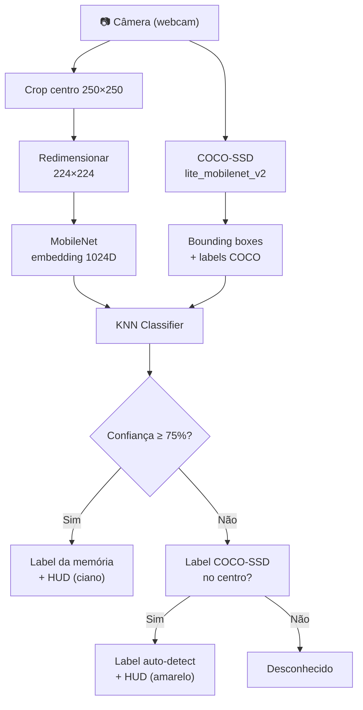

# Neural Vision v7.5

Reconhecimento visual em tempo real no navegador com TensorFlow.js.

## Arquitetura

### Componentes

1. **COCO-SSD (lite_mobilenet_v2)** — detecta objetos na cena inteira, devolve bounding boxes + classe
2. **MobileNet (standard)** — extrai embedding 1024D do centro da imagem (crop 250×250 → redimensionado para 224×224)
3. **KNN Classifier** — classifica o embedding comparando com exemplos memorizados pelo usuário (threshold ≥ 75%)
4. **Fallback** — se o KNN não reconhece, usa a classe do COCO-SSD se o centro do quadro acertar em uma box
5. **HUD** — crosshair, label, origem (MEMÓRIA vs AUTO DETECT) e bounding boxes secundárias desenhadas no canvas
6. **Persistência** — dataset serializado em localStorage e exportável como `.txt` (formato binário base64 com manifest JSON)

## Funcionalidades

- Detecção automática de 12 classes COCO traduzidas para português
- **Memorizar**: aponte a câmera para um objeto, clique "Memorizar" e dê um nome
- Alternar câmera frontal/traseira
- Persistência dos exemplos em localStorage
- Exportar/importar dataset como arquivo `.txt`
- Interface mobile-first com glass-morphism

## Modelos utilizados

| Modelo | Versão | Precisão |
|---|---|---|
| COCO-SSD | lite_mobilenet_v2 | ~55% mAP (COCO) |
| MobileNet | padrão | ~70% top-1 (ImageNet) |
| KNN Classifier | k=1-3 (dinâmico) | depende dos exemplos do usuário |

## Como usar

1. Abra o `index.html` em um servidor local (ou Android + servidor HTTP)
2. Conceda permissão à câmera
3. Aponte para objetos — são detectados automaticamente (amarelo)
4. Clique **Memorizar** para ensinar um nome personalizado (ciano = memória)

## Backup

- **Download (.txt)**: exporta o dataset serializado em base64
- **Restaurar**: carrega um arquivo `.txt` previamente exportado

## Notas

- Necessita de internet para carregar os modelos TensorFlow.js e dependências CDN
- Recomendado Chrome ou Edge no Android para melhor compatibilidade com a câmera
- Dataset personalizado fica apenas no navegador (localStorage)
